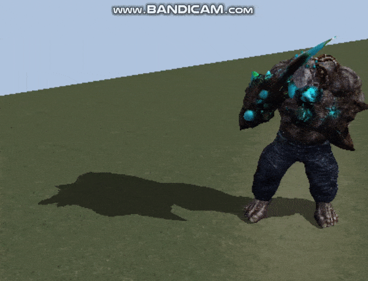

# FBX-Loader
- FBX 파일 로드 공부용 저장소
- Import FBX files into DirectX.
    - Mesh, Materials, Animations and so on

 

## Animation

 

## 참고
- FBX
    - [FBX SDK Reference](http://help.autodesk.com/view/FBX/2018/ENU/)
    - [FBX SDK 사용법](http://boycoding.tistory.com/129?category=990597)
    - [Loading FBX Models](http://www.walkerb.net/blog/dx-4/)
    - How to Work with FBX SDK 
        - [원문](https://www.gamedev.net/articles/programming/graphics/how-to-work-with-fbx-sdk-r3582) / [번역1](https://blog.naver.com/jidon333/220264337935), [번역2](https://blog.naver.com/jidon333/220264383892)
        
- Texture Image Loader
    - [Textures From File](https://www.braynzarsoft.net/viewtutorial/q16390-directx-12-textures-from-file)
- Animation Data
    - [Mixamo](https://www.mixamo.com/#/)